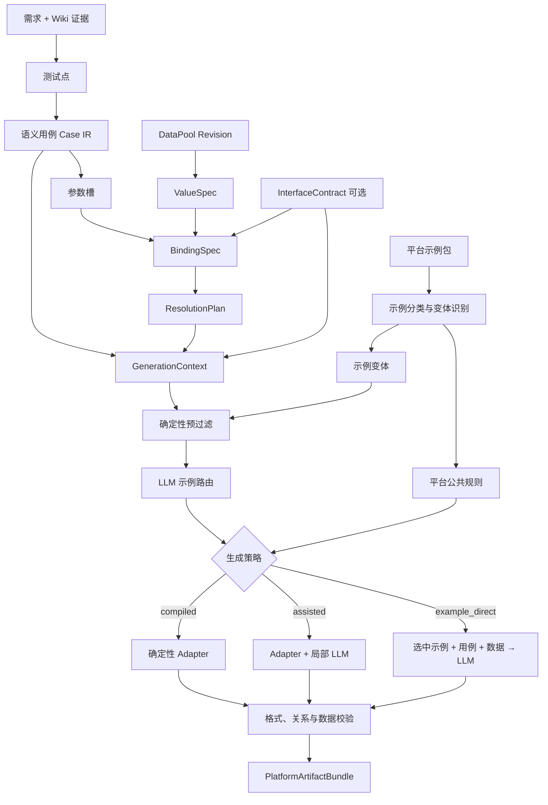
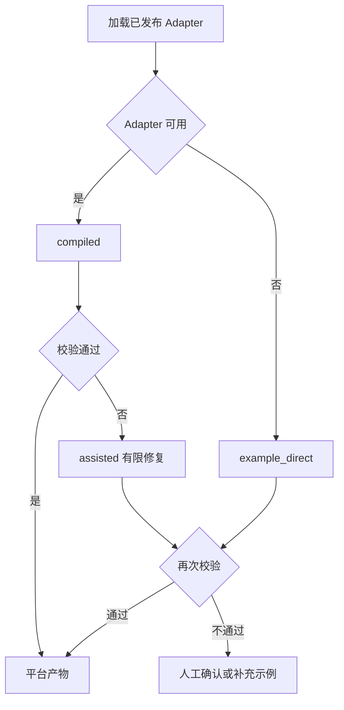

# CaseGen 多数据池与示例驱动平台用例生成设计规格

**日期：** 2026-08-26  
**状态：** 待评审  
**范围：** 在现有需求、Wiki、测试点和用例生成链路之上，增加通用测试数据管理与示例驱动的平台产物生成能力。  
**兼容原则：** 保留现有 Markdown 用例与生成任务，不要求首期迁移为全新 Project。

## 1. 背景与设计结论

CaseGen 当前擅长从需求和 Wiki 证据生成测试点及 Markdown 用例，但“测试设计”和“平台可导入产物”仍是同一层概念。实际对接中至少存在四类相互独立的资产：

1. **用例**：平台无关的测试意图、步骤和断言。
2. **用例格式**：目标平台的字段、关键字、步骤结构和文件格式。
3. **数据**：账户、产品等实体数据，以及“上下五档内价格”等抽象数据。
4. **数据格式**：数据源结构、被测接口字段以及平台如何承载测试数据。

同时，平台并非只有一种拓扑：A 类平台将用例、数据和关系分别保存；B 类平台将用例与数据放在同一份产物中；同一平台还可能按股票、基金等业务类型提供不同示例。若把这些差异固化在通用用例或单个 Prompt 内，将造成格式污染、数据错绑和平台适配代码膨胀。

本设计采用以下结论：

> 先生成平台无关的语义用例和标准数据表达，再根据当前上下文选择一个平台示例变体；优先归纳并复用 Adapter，无法可靠归纳时以“选中示例 + 语义用例 + 数据”让 LLM 直接生成平台产物，并对结果进行确定性校验。

## 2. 目标与非目标

### 2.1 目标

1. 一个项目可维护多个相互隔离、独立版本化的数据池。
2. 数据字段可表示字面值、实体引用和抽象表达式，不硬编码金融实体类型。
3. 同一语义用例可绑定不同数据版本并生成不同平台产物。
4. 用户可通过平台示例描述用例格式、数据格式和两者的关系。
5. 同一平台可包含多个示例变体；生成基金用例时不得把股票示例送入后续 LLM。
6. 同时兼容用例/数据分离、用例/数据一体及混合式平台。
7. Adapter 可用时走稳定编译，局部不确定时允许 LLM 辅助，无法归纳时允许示例直接生成兜底。
8. LLM 推断可追踪、可验证、可人工覆盖；实体数据不得被静默编造。
9. 每次生成能追溯到需求、用例、数据、示例、Prompt、模型和产物版本。

### 2.2 非目标

- 首期不自动适配所有外部测试管理平台。
- 首期不默认把生成结果直接推送到真实平台。
- 不把产品、账户、PBU、股票、基金等业务概念写死在底层数据模型中。
- 不让 LLM 负责数据查询、Join、抽样、正式关联、序列化或外部写入。
- 不保证仅凭少量且互相矛盾的示例即可得到可靠 Adapter。
- 不把全部数据行、客户文档或敏感实体值放入普通 Prompt、日志或生成快照。

## 3. 核心术语

| 术语 | 定义 |
|---|---|
| Project | 知识、需求、用例、数据池和平台配置的隔离边界；目标模型中的聚合根 |
| 语义用例 CaseDefinition | 不含平台字段和平台关键字的测试设计 |
| 参数槽 ParameterSlot | 语义用例执行所需的数据角色、类型和约束 |
| 数据池 DataPool | 用户导入或维护的一组测试数据，具有属性和不可变版本 |
| ValueSpec | 单个数据值的统一声明式表达 |
| Resolver | 将抽象 ValueSpec 保留、翻译或解析为具体值的组件 |
| InterfaceContract | 被测系统的接口字段及其类型、必填、枚举和约束 |
| BindingSpec | 参数槽、数据池字段和可选接口字段之间的正式绑定规则 |
| 平台示例包 | 平台用例、数据、关系、模板、关键字和说明的原始样例集合 |
| 示例变体 ExampleVariant | 同一平台中适用于某类场景的一组配套示例 |
| Adapter | 将语义用例和标准数据编译为平台产物的规则 |
| PlatformArtifactBundle | 一次平台生成得到的一个或多个文件或 Payload 的集合 |

## 4. 总体架构



架构的稳定分界是：语义用例和 ValueSpec 表达“要测什么、需要什么数据”，平台 Adapter 表达“如何交付给某个平台”。A、B 平台的差异只出现在最后的产物编译阶段。

## 5. 项目隔离

### 5.1 目标模型

长期目标新增 `Project` 作为聚合根：

```text
Project
  id
  name
  slug
  description
  status
  default_wiki_space_id
  default_platform_profile_id
  created_at
  updated_at
```

项目下隔离：WikiSpace、Requirement、CaseDefinition、DataPool、InterfaceContract、PlatformProfile、BindingSpec、GenerationTask 和 PlatformArtifactBundle。模型与全局 Prompt 可继续共享，但调用记录必须保存使用版本。

### 5.2 迁移策略

当前系统已使用 WikiSpace 隔离文档、Wiki 和生成任务。引入 Project 时应为每个既有 WikiSpace 建立一对一 Project，先保留原 `wiki_space_id` API，再逐步迁移资产，不直接重命名旧表或破坏历史任务。

## 6. 语义用例与参数槽

### 6.1 CaseDefinition

```text
CaseDefinition
  id
  project_id
  stable_key
  status

CaseDefinitionRevision
  case_definition_id
  revision
  canonical_json
  content_md
  source_task_id
  evidence_snapshot_ref
  content_hash
  created_at
```

`canonical_json` 是绑定和编译的权威结构，Markdown 是编辑、评审和兼容展示格式。语义用例不能包含某个测试平台专有的字段名、数据集 ID 或关键字。

### 6.2 ParameterSlot

```json
{
  "case_key": "TC-001",
  "title": "合法价格下单成功",
  "priority": "P1",
  "parameter_slots": [
    {"key": "account", "semantic_role": "account", "required": true},
    {"key": "product", "semantic_role": "product", "required": true},
    {"key": "price", "semantic_role": "order_price", "value_type": "decimal", "required": true}
  ],
  "steps": [
    {"action": "提交订单", "expected": "订单创建成功"}
  ],
  "test_point_keys": ["TP-001"],
  "citations": []
}
```

参数槽声明用例需要的数据含义，但不选择真实账户或具体价格。数据选择和实例化属于 BindingSpec 与 Resolver。

## 7. DataPool 与 ValueSpec

### 7.1 数据池和不可变版本

```text
DataPool
  id
  project_id
  name
  description
  attributes_json
  sensitivity_level
  current_revision_id
  status

DataPoolRevision
  id
  pool_id
  revision
  source_kind             # csv | json | description
  source_hash
  schema_snapshot_json
  record_count
  content_hash
  status
  created_at
```

数据池属性可表达 `asset_class=fund`、`environment=test` 等任意项目标签。发布版本不可原地修改；修改产生新版本。CSV/JSON 优先确定性解析，描述型输入由 LLM 生成候选结构并经人工确认。

### 7.2 统一 ValueSpec

数据池不应被刚性拆成“实体表”和“抽象表”。每个字段独立使用 ValueSpec，因此同一记录可混合：

- `literal`：字面值，例如数量 `2`。
- `entity_ref`：引用另一个池中的实体。
- `expression`：抽象表达式，例如“上下五档内价格”。
- `range`：范围约束。
- `choice`：候选集合。
- `constraint`：只描述必须满足的条件。
- `generated`：由受控生成器产生。

```json
{
  "scenario_key": "ORDER_VALID_001",
  "values": {
    "account": {
      "kind": "entity_ref",
      "pool": "accounts",
      "selector": {"account_id": "A001"}
    },
    "product": {
      "kind": "entity_ref",
      "pool": "products",
      "selector": {"symbol": "BTC-USDT"}
    },
    "price": {
      "kind": "expression",
      "operator": "within_depth",
      "subject": {"ref": "product"},
      "arguments": {"depth": 5},
      "output_type": "decimal"
    },
    "quantity": {"kind": "literal", "value": 2}
  }
}
```

“实体数据池”和“抽象数据池”可作为用户可见分类或筛选标签，但不成为限制底层数据能力的两套模型。

## 8. Resolver 与 ResolutionPlan

抽象值不应默认在设计阶段物化。`ResolutionPlan` 决定解析时机：

```text
design_time
export_time
execution_time
platform_native
```

```text
ResolverDefinition
  operator
  input_schema
  output_type
  required_context
  supported_phases
  implementation_kind
  implementation_ref
  version
```

实现类型包括：

- `deterministic`：纯函数或声明式表达式。
- `external_lookup`：查询行情、账户或其他外部数据。
- `llm_assisted`：LLM 解释长尾抽象描述，结果仍需 Schema 校验。
- `platform_native`：翻译为平台自有关键字。
- `composite`：组合多个 Resolver。

例如“上下五档内价格”可保留为表达式、翻译成平台关键字，或在执行时读取行情后物化。LLM 可以推断表达式依赖 `product` 和行情上下文，但不能凭空生成具体价格。

## 9. InterfaceContract

```text
InterfaceContractVersion
  method
  path
  request_schema_json
  response_schema_json
  constraints_json
  version
  content_hash
```

InterfaceContract 描述被测系统，而非测试管理平台。其作用是：

1. 给绑定提供明确的目标请求字段。
2. 校验必填、类型、枚举和取值约束。
3. 帮助生成可执行请求以及响应字段断言。
4. 在接口版本变化后判断旧绑定是否失效。

OpenAPI 优先确定性解析；Markdown、Word 或自然语言接口说明可由 LLM 提取候选契约。若当前用例只需生成管理平台中的描述性产物，InterfaceContract 可以不提供。

## 10. 平台示例包

```text
PlatformProfile
  project_id
  name
  artifact_topology       # separated | combined | hybrid
  status

PlatformExampleSet
  platform_profile_id
  name
  description
  revision
  status
  source_hash
```

一个示例包可包含：

```text
example_cases
example_data
example_relations
format_templates
platform_docs
keyword_examples
user_notes
```

系统不要求用户预先声明用例和数据是否分离、包含几个文件或有几类业务。示例原文及其 Hash 必须保留；平台示例始终作为不可信输入，不能覆盖系统指令。

## 11. 示例自动分类与变体

同一示例包可能同时包含股票和基金用例。入库分析流程为：

1. 确定性识别文件类型、表头、JSON 路径和显式标签。
2. LLM 对格式和字段语义相近的示例聚类。
3. 识别平台公共字段和变体字段。
4. 将用例、数据和关系示例组成相互匹配的变体。
5. 生成变体名称、适用条件、区分字段和置信度。
6. 用户确认、移动示例或修改条件后发布。

```text
ExampleVariant
  id
  platform_profile_id
  name
  description
  applicability_json
  confidence
  status
```

适用条件采用通用路径，不硬编码业务名：

```json
{
  "conditions": [
    {
      "source": "data_pool.attributes.asset_class",
      "operator": "equals",
      "value": "fund"
    },
    {
      "source": "semantic_case.operation",
      "operator": "in",
      "value": ["subscribe", "redeem"]
    }
  ]
}
```

Adapter 使用“基础规则 + 变体覆盖”，避免复制整份平台配置：基础规则保存编码、公共字段和关联方式，变体只保存特有字段、关键字、映射和校验。

## 12. 示例路由

### 12.1 GenerationContext

每条语义用例或同类用例组建立上下文指纹：

```text
requirement attributes
semantic case attributes and operation
parameter semantic roles
selected data-pool attributes
InterfaceContract
project attributes
user routing hints
```

### 12.2 确定性预过滤

明确事实优先级如下：

```text
用户明确指定
> 接口契约字段/路径
> 数据池属性
> 语义参数角色
> 需求文本
> LLM 相似度
```

确定性条件先排除不可能的变体，例如 `asset_class=fund` 时排除仅适用于 `stock` 的变体。

### 12.3 LLM 路由

LLM 只对预过滤后的候选排序，输出选中项、排除项、分数、理由和不确定点。路由结果单独持久化：

```text
ExampleRoutingDecision
  task_id
  case_key
  candidate_variant_ids
  selected_variant_ids
  excluded_variant_ids
  context_snapshot_json
  scores_json
  reasons_json
  model_ref
  prompt_revision
  status                 # suggested | confirmed | overridden | ambiguous | no_match
```

后续 LLM 只能收到选中变体的示例，不能把同平台所有示例一起加入上下文。同一任务包含股票和基金时，应按用例或用例组分别路由，而不是为整个任务只选一个变体。

## 13. Adapter 归纳与示例回放

LLM 从已确认的示例变体归纳 `PlatformAdapterSpecRevision`：

```text
artifact_topology
artifact definitions
case_schema_json
data_schema_json
relation_schema_json
parameter_syntax
field_mappings_json
keyword_catalog_json
validation_rules_json
confidence
status
```

归纳结果不能凭 LLM 自报置信度直接发布。系统必须执行示例回放：

```text
原始示例
  → LLM 归纳 Adapter
  → 用 Adapter 重建示例
  → 结构、关系、语义比较
  → 发布或退回人工确认
```

回放至少验证：

- 文件能解析，CSV 表头、JSON/XML 结构与编码满足规则。
- 必填字段、类型、枚举和固定值完整。
- 用例引用的数据集存在，没有孤立关系。
- 参数未错位，步骤和预期未丢失。
- 抽象值没有被任意改成无来源的具体值。
- 平台关键字位于正确字段并来自允许目录。

## 14. BindingSpec

Prompt 只生成映射建议，正式关系必须结构化和版本化：

```text
BindingSpecRevision
  project_id
  case_selector_json
  interface_contract_id
  data_pool_revision_ids
  mappings_json
  selection_policy_json
  prompt_revision_id
  model_ref
  validation_result_json
  content_hash
```

```json
{
  "parameter": "account",
  "source": "$.values.account",
  "target": "$.request.accountId",
  "required": true,
  "confidence": 0.96
}
```

确定性程序检查源/目标存在、类型兼容、必填覆盖、转换白名单、重复目标、多数据池 Join 条件和实例上限。多池组合必须显式指定 Join Key、组合方式、过滤条件、抽样策略和最大生成数量。

需区分两类绑定：

- **业务数据绑定**：数据池字段 → 参数槽/被测接口字段。
- **平台关联绑定**：平台用例参数 → 平台数据字段或数据集 ID。

InterfaceContract 只参与前者；平台自己的用例—数据关系属于 Adapter。

## 15. 三级生成策略与自动降级

### 15.1 compiled

Adapter 已通过示例回放，使用确定性编译器生成结构、ID、关系和文件。适合规则稳定的成熟平台。

### 15.2 assisted

确定性程序生成主体，LLM 只处理自由文本、描述风格、允许目录内的关键字选择和难以规则化的局部字段。ID、正式数据关联和序列化仍由程序负责。

### 15.3 example_direct

Adapter 不存在、回放失败或平台格式高度自由时，输入仅包含：选中变体示例、语义用例、受控数据样例和用户说明；LLM 直接输出结构化 Artifact Bundle。结果仍必须通过文件、关系、数量和数据来源校验。

### 15.4 自动降级



LLM 修复应限制次数，例如最多两次。低置信度路由或无匹配变体不得静默选择近似示例。

## 16. A/B 平台与 PlatformArtifactBundle

统一产物模型：

```text
PlatformArtifactBundle
  task_id
  platform_profile_id
  adapter_revision_id
  routing_decision_ids
  generation_mode
  manifest_json
  validation_status
  status

PlatformArtifact
  bundle_id
  kind                  # case | data | relation | combined | attachment | manifest
  filename
  media_type
  content_ref
  content_hash
```

### 16.1 A 类分离式平台

典型产物：

```text
cases.csv
datasets.csv
case_dataset_relations.csv
manifest.json
```

若平台通过用例内的数据集字段关联，可以没有独立 relation 文件，但校验结果需提示用户确认。

### 16.2 B 类一体式平台

典型产物：

```text
combined_cases.json
manifest.json
```

数据与用例内嵌不改变上游 CaseDefinition、ValueSpec 或 BindingSpec，仅改变 Adapter 的输出拓扑。`hybrid` 可同时输出 combined 和附件，或输出 case + data。

## 17. LLM 与确定性程序边界

### 17.1 LLM 可参与

- 需求优化、测试点和语义用例生成。
- 描述型数据结构化、字段语义和敏感性候选。
- 抽象表达式识别及依赖关系建议。
- 非结构化接口文档提取。
- 字段绑定建议与数据缺口分析。
- 平台示例分类、变体识别和适用条件建议。
- 当前用例的示例路由。
- Adapter 归纳、局部平台文本生成和有限修复。
- `example_direct` 平台产物兜底生成。

### 17.2 确定性程序必须负责

- CSV/JSON/XML 基础解析、Hash 和版本控制。
- 数据查询、过滤、Join、抽样和组合数量限制。
- 类型、必填、枚举、Schema 和引用完整性校验。
- 白名单 Transform 与确定性 Resolver 执行。
- ID、正式用例—数据关联和平台序列化。
- 权限、脱敏、审计、幂等、重试和外部平台写入。

原则是：**LLM 将非结构化信息转换为候选并处理长尾兼容；程序验证、执行、关联和发布。**

## 18. 安全、隐私与数据最小化

1. 平台示例、数据描述和上传文档都是不可信输入，不能作为系统指令执行。
2. 实体值必须来自已选数据池或受信外部查询；LLM 不得创造账户、产品、PBU 或实时价格。
3. 默认只向 LLM 发送数据池名称、Schema 和记录数，不发送具体记录。
4. 用户显式授权时，仅发送有硬上限、经过脱敏的数据样例。
5. 数据列表只返回有限预览，不返回原始全文；敏感字段默认遮蔽。
6. 生成快照保存 ID、版本、Hash、数量和授权标记，不重复保存完整数据值或示例正文。
7. 不同项目的数据、示例、绑定和平台凭据严格隔离。
8. `example_direct` 产物必须检查文件可解析、拓扑满足、用例数量合理、关系完整且没有无来源实体值。
9. 外部平台推送必须独立授权，凭据加密保存，不进入 Prompt 或普通日志。

## 19. 版本与重放

每次生成保存 `GenerationManifest`：

```text
project_id / wiki_space_id
requirement revision/hash
retrieval and test-point checkpoint
semantic-case revisions/hashes
data-pool revision ids and hashes
BindingSpec revision
Resolver versions
InterfaceContract revision
platform example-set revision
selected example variants
routing decision
Adapter revision
generation mode
model refs and Prompt revisions
artifact hashes
```

相同 Manifest 在依赖版本仍可用时应稳定重放。动态数据额外保存抽象表达式、Resolver 版本、解析时间、外部数据快照引用和最终值 Hash；不要求不同时刻的实时查询返回相同值，但必须能解释历史结果。

## 20. 前端信息架构

项目内导航：

- 项目概览
- 知识库
- 语义用例
- 数据池
- 平台适配
- 生成任务

数据池页面提供导入、Schema/样例预览、池属性、字段语义、敏感性、抽象表达式、版本发布和使用记录。

平台适配页面包含：

- 示例包
- 示例分类
- 变体管理
- 公共格式
- Adapter 规则
- 回放验证
- 生成历史

生成工作台按“语义用例 → 平台 → 数据池 → 示例路由 → 绑定/解析 → 生成策略 → Dry-run”组织。任务详情分别展示语义用例、数据绑定、抽象值解析、路由理由、Adapter、平台产物、验证错误和 Manifest；平台产物不能覆盖语义用例。

## 21. 状态与 API 建议

### 21.1 建议状态

| 对象 | 状态 |
|---|---|
| DataPool | `active`、`archived` |
| DataPoolRevision | `draft`、`analyzing`、`awaiting_confirmation`、`published`、`failed` |
| ExampleVariant | `draft`、`awaiting_confirmation`、`published`、`archived` |
| AdapterRevision | `draft`、`validating`、`published`、`rejected` |
| RoutingDecision | `suggested`、`confirmed`、`overridden`、`ambiguous`、`no_match` |
| PlatformRenderRun | `queued`、`running`、`completed`、`failed` |
| ArtifactBundle | `draft`、`validated`、`published`、`push_failed` |

### 21.2 建议 API 分组

```text
/api/projects/{project_id}/data-pools
/api/data-pools/{pool_id}/revisions
/api/platforms
/api/platforms/{platform_id}/example-sets
/api/example-sets/{set_id}/classify
/api/platforms/{platform_id}/variants
/api/variants/{variant_id}/examples
/api/variants/{variant_id}/adapter-revisions
/api/adapter-revisions/{id}/replay
/api/binding-specs
/api/example-routing/preview
/api/platform-renders
/api/platform-renders/{run_id}
/api/artifact-bundles/{bundle_id}
```

所有项目级 API 必须由后端校验隔离键，不能依靠前端过滤。耗时的分类、归纳、回放和生成应逐步转为后台 Job；创建请求返回任务 ID，查询或事件流返回阶段、进度和明确错误。

## 22. 分期实施

### Phase 1：语义与数据基础

- 引入 Project 聚合或完成 WikiSpace 兼容边界。
- Case IR 和 ParameterSlot。
- DataPool、不可变版本和 ValueSpec。
- CSV、JSON、描述型导入及基础 Resolver。

### Phase 2：示例直接生成 MVP

- PlatformProfile、ExampleVariant 和示例管理。
- 手工选择单个变体。
- `example_direct` 和 PlatformArtifactBundle。
- separated、combined、hybrid 基础校验。
- 数据最小化、生成记录和失败审计。

### Phase 3：自动分类与 Adapter

- LLM 示例聚类、公共规则和变体识别。
- 适用条件确认。
- Adapter 归纳与示例回放。
- `compiled` 和 `assisted`。

### Phase 4：完整编排

- 自动示例路由。
- InterfaceContract、BindingSpec 和 ResolutionPlan。
- 自动降级、有限修复和完整 Manifest 重放。

### Phase 5：真实平台连接

- 平台连接器、连接测试和凭据治理。
- 幂等推送、失败重试。
- 远端用例、数据集及关系 ID 回写。

## 23. 验收标准

1. 一个项目可以创建多个相互隔离的数据池和平台。
2. CSV、JSON 和描述型数据可生成版本、Schema、记录数和有限预览。
3. ValueSpec 可在同一记录中混合实体引用、抽象表达式和字面值。
4. 混合示例可分为多个变体，分类结果可人工修正。
5. 基金用例后续上下文不包含未选中的股票示例。
6. 同一任务包含多类用例时可按用例或用例组分别路由。
7. A 类平台可生成用例、数据及可选关系产物。
8. B 类平台可生成用例数据一体产物。
9. Adapter 通过回放后可稳定编译同类输入。
10. Adapter 不可用时可降级到 `example_direct`，且结果经过基础验证。
11. 抽象表达式可保留、由 Resolver 物化或翻译为平台关键字。
12. 不存在的实体值不会被 LLM 静默编造。
13. 默认不向 LLM 发送数据记录，显式授权样例有硬上限并可审计。
14. 低置信度路由、数据缺口和不可解析产物进入人工确认。
15. 每次生成可追溯到用例、数据、示例、Adapter、Prompt 和模型版本。
16. 项目 A 的数据、示例和产物不能通过项目 B 的 API 查询或用于生成。

## 24. 当前初版落地状态

截至 2026-08-26，仓库已完成 Phase 2 的一个最短纵向切片，但尚未达到本规格的完整目标架构。

### 24.1 已实现

- 暂以 **WikiSpace 作为项目隔离边界**，尚未新增 Project 聚合根。
- `DataPool` 与 `DataPoolRevision` 新表，支持 CSV、JSON 和 description 输入；CSV/JSON 确定性解析，description 可选择 LLM 解析候选。
- 数据记录保存任意 JSON，类似“上下五档内价格”的抽象字符串不会被金融特化逻辑改写。
- 手工创建 `PlatformProfile`、`ExampleVariant` 和 `PlatformExample`，支持 `case`、`data`、`relation`、`combined` 等示例类型。
- 用户手工且单选一个变体执行 `example_direct`；后端只查询并发送所选 `variant_id` 的示例。
- 支持 `separated`、`combined`、`hybrid` 三种 `artifact_topology` 的基础产物校验，并对 JSON/CSV 做最低限度解析校验。
- 保存 `PlatformRenderRun`、产物 Hash、模型/Prompt 引用和输入 Manifest；模型缺失或调用失败会进入 `failed`，不会永久停在 `running`。
- 数据池 API 只返回记录数和有限预览；平台生成默认只向 LLM 发送池名、Schema 和记录数。用户显式授权后最多发送 20 条样例，Manifest 不重复保存具体数据值。
- 前端已有“数据池”和“平台适配”页面；空间切换会清空选择，语义用例列表由后端按 WikiSpace 隔离。
- 新 Prompt 已通过现有 Seed 机制注册，并明确把示例视为不可信输入。

关键实现文件：

- `backend/app/models/entities.py`
- `backend/app/schemas/platform_data.py`
- `backend/app/api/platform_data.py`
- `backend/app/default_prompts/platform_example_render.md`
- `backend/app/default_prompts/data_description_parse.md`
- `backend/app/services/prompts_seed.py`
- `backend/tests/test_platform_data.py`
- `frontend/src/api/platformData.ts`
- `frontend/src/views/DataPoolsView.vue`
- `frontend/src/views/PlatformAdaptersView.vue`

### 24.2 尚未实现

- 独立 Project 聚合根及从 WikiSpace 的正式迁移。
- 结构化 CaseDefinition Revision、ParameterSlot 和完整 Case IR。
- ValueSpec 的结构化类型系统以及 Resolver/ResolutionPlan 执行框架。
- InterfaceContract 导入、校验和版本管理。
- BindingSpec、数据 Join/抽样/实例化和业务字段绑定确认。
- 平台示例自动分类、公共规则提取和变体自动识别。
- 基于 GenerationContext 的确定性预过滤与 LLM 自动路由；当前由用户手工单选变体。
- Adapter 归纳、示例回放、`compiled` 和 `assisted`；当前只实现 `example_direct`。
- 完整 PlatformArtifactBundle 发布流程、下载编排和 Manifest 重放。
- 真实平台连接器、凭据管理、推送、幂等重试和远端 ID 回写。

初版的定位是验证“通用数据 → 单变体示例隔离 → A/B 平台产物”的最短链路。后续应优先建设示例自动分类与路由，再引入 Adapter 回放；不应在初版模型上直接堆积平台专用字段。
